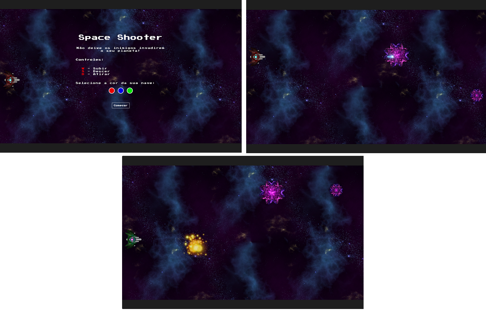

# Órbi Web Games Developer: Space Shooter

Projeto desenvolvido no bootcamp Órbi Web Games Developer em parceria com a [Digital Innovation One](https://digitalinnovation.one).

## Para rodar o projeto

Para executarmos o projeto, basta apenas abrir o arquivo index.html em um navegador de preferência.

## Controles
- **D**: Atirar
- **W**: Subir
- **S**: Descer

## Imagem do jogo

## Assets, Música e Efeitos:

- [Itch.io - Screaming Brain Studios](https://screamingbrainstudios.itch.io/seamless-space-backgrounds)
- [Itch.io - GameSupply](https://gamesupply.itch.io/)
- [OpenGameArt](https://opengameart.org/content/explosions)
- [dig.ccmixter - A Little Ditty on the Dance Floor - J.Lang](http://dig.ccmixter.org/files/djlang59/62747)